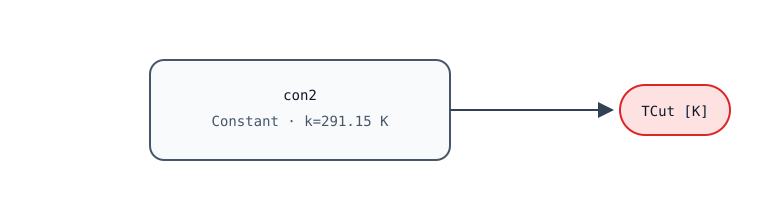

# ASHRAE 90.1 fixed 18 °C dry-bulb economizer high limit

| Field | Value |
|---|---|
| Routine ID | `G36-GEN-AEHL__ashrae-fixed-dry-bulb-18` |
| Status | `source_evidenced` |
| Evidence | E3 |
| Runtime profile | `HostTick-v1` |

## Purpose

This output-only specialization provides the fixed outdoor-air economizer
temperature cutoff for the ASHRAE 90.1 fixed dry-bulb 18 °C bucket. The source
groups climate zones 1A, 2A, 3A, and 4A in this bucket. The fixture selects zone
1A as its representative fixed configuration.

Fixed parameters:

- `eneStd = Buildings.Controls.OBC.ASHRAE.G36.Types.EnergyStandard.ASHRAE90_1`
- `ecoHigLimCon = Buildings.Controls.OBC.ASHRAE.G36.Types.ControlEconomizer.FixedDryBulb`
- `ashCliZon = Buildings.Controls.OBC.ASHRAE.G36.Types.ASHRAEClimateZone.Zone_1A`

## Interface and behavior

| Connector | Direction | Type | Unit | Quantity |
|---|---|---|---|---|
| `TCut` | output | Real scalar | K | ThermodynamicTemperature |

For this specialization:

```text
TCut = 291.15 K (18 °C)
```

The donor fixture preserves the selected source branch as
`Buildings.Controls.OBC.CDL.Reals.Sources.Constant` instance `con2` with
`k=291.15 K`. The routine has no boundary inputs, state, optional connectors,
or host services beyond the tick call.



## Replay and evidence

`vectors.json` replays the donor reference at 0 seconds with an empty input
object and expects `TCut = 291.15 K` with zero absolute tolerance. The graph and
files under `golden/` are preserved from the donor and hash-locked in
`provenance.json`.

The stable routine ID names the human contract. The evaluator-derived content
ID is recorded separately in `provenance.json`.

## Completeness

- Donor configuration: complete for this fixed variant.
- Canonical class: partial; 10 of 12 donor variants are present.
- Family package: not applicable to this leaf.
- Declared guideline profile: partial.

This card does not claim complete AirEconomizerHighLimits, generic-family,
donor-set, or G36 coverage.

## Exclusions

Climate-zone selection is fixed rather than exposed as an input. Other fixed
temperature buckets, differential controls, arrays, member lists, packages,
controller traces, and E4/E5 evidence are outside this bundle. Modelica and
EnergyPlus execution are not claimed.

## References

- Modelica Buildings, `Buildings/Controls/OBC/ASHRAE/G36/Generic/AirEconomizerHighLimits.mo`, at `SOURCE_PIN`.
- Open Control Engine fixture and independent oracle files at `DONOR_PIN`.
- Redistribution terms: `LICENSE-BUILDINGS.html` and `THIRD_PARTY_NOTICES.md`.
