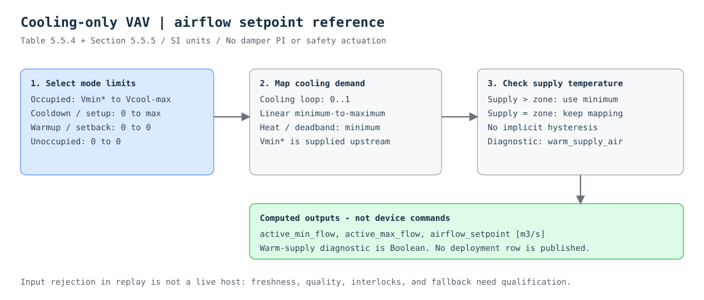

## Purpose

Calculate the active airflow limits and airflow setpoint for a **cooling-only VAV
terminal**. This class covers the mode table and setpoint mapping, not the damper
controller, zone loops, ventilation calculation, or a complete section 5.5 system.

## Source behavior

The baseline is the supplied **2018 edition, Table 5.5.4 and section 5.5.5,
printed page 33 (PDF page 35)**, checked against the rendered table and the
control diagram on printed page 34 (PDF page 36). No addenda are applied.

| Group mode | Active minimum | Active cooling maximum |
|---|---|---|
| Occupied | Supplied occupied minimum `Vmin*` | Supplied cooling maximum |
| Cooldown | Zero | Supplied cooling maximum |
| Setup | Zero | Supplied cooling maximum |
| Warmup | Zero | Zero |
| Setback | Zero | Zero |
| Unoccupied | Zero | Zero |

When the zone is cooling and AHU supply temperature is **not greater than** zone
temperature, map the cooling loop linearly between these limits. Heating or
deadband selects the active minimum. If AHU supply temperature is greater than
zone temperature, also select the active minimum. At exactly equal temperatures,
the cooling mapping remains active: the source uses a strict greater-than test.

`warm_supply_air` exposes that temperature comparison for inspection; it is not
an equipment interlock or a G36 alarm. Zero limits in warmup/setback apply to this
cooling-only terminal, not to reheat terminals or freeze-protection systems.

## Inputs and outputs

`cooling` is a Boolean zone-state input, not the group mode. It may come from the
thermal-zone-state reference. `cooling_loop` is a finite fraction in `[0, 1]`.
`occupied_min_flow` is **already calculated Vmin***, including applicable upstream
ventilation logic; it is not an outdoor-air fraction or a hard-coded design
minimum. `cooling_max_flow` is the configured maximum. Both are software values
in `m3/s`, finite and nonnegative, with minimum no larger than maximum.

Temperatures are finite absolute Kelvin values from the same accepted frame.
The interface declares Kelvin even though the comparison is invariant under a
consistent Celsius-to-Kelvin conversion. Mixing units is not permissible.

The six group-mode symbols are local interface values. The reference CXF lowers
them to integers **1 occupied, 2 cooldown, 3 setup, 4 warmup, 5 setback,
6 unoccupied**. These are **Library reference ABI codes, not an assertion of
Modelica Buildings' integer encoding**. Other mode sources require explicit
symbol-to-code translation. Freeze-protection setback is a host mode decision;
this table does not introduce a separate seventh mode.

The three Real outputs are `active_min_flow`, `active_max_flow`, and
`airflow_setpoint`, all `m3/s`; `warm_supply_air` is Boolean. Engineering limits
are runtime software inputs so their values are not frozen into the CXF.

## What remains outside this class

Upstream generic thermal-zone logic, generic ventilation and DCV, time-averaged
ventilation, damper PI control, loop initialization/anti-windup/rate limits,
commissioning overrides, equipment proofs, reset requests, faults, and safety
interlocks are **not implemented here**. In particular, a calculated zero airflow
is not a universal safe action. An electric heater's minimum airflow or a
freeze-protection requirement must not be bypassed by this cooling-only class.

This reference is deliberately algebraic: no timer, persisted state, startup
history, or Modelica event-iteration equivalence is being claimed. A later
field-ready version must qualify any added temperature hysteresis against an
explicit behavior profile rather than silently changing equality boundaries.

## Admission and deployment

The offline reference runner rejects missing inputs, invalid types, out-of-range
fractions, negative/nonfinite flows or temperatures, reversed airflow limits,
and unknown group modes before replay. These checks are **not part of the raw
CXF graph and not a production Studio host**. A future host must additionally
qualify freshness, quality, frame coherence, mapping, permissions, priorities,
watchdogs, and site-specific fallback behavior. No deployment row is published.

## Evidence to inspect

Authored vectors cover all group modes, midpoint and endpoint mapping, warm-air
inhibition, temperature equality, noncooling operation, and changing mode/limits.
A generated matrix tests each mode against cooling status, loop endpoints and
midpoint, multiple airflow ranges, and both sides of the temperature boundary.
These checks do not demonstrate ventilation compliance or safe damper operation.

[Open the complete CXF block graph](diagram.svg)

See [source notes](source.md), [typed interface](interface.json),
[reference input contract](reference.json), [CXF](reference.cxf.jsonld), and
[test vectors](vectors.json).
