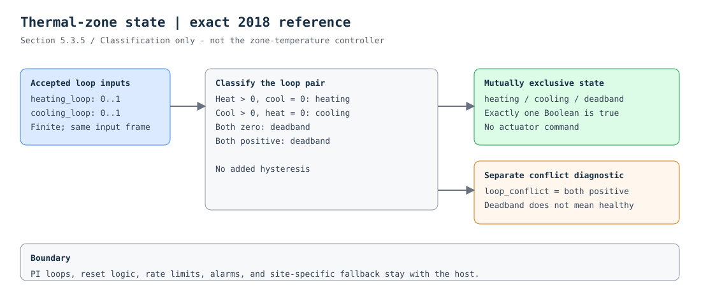

## Purpose

Classify an already computed pair of zone heating and cooling loop outputs.
This is **not the zone-temperature controller**. The PI loops, their enable/reset
logic, temperature setpoints, rate limits, and alarms remain outside this class.

## Source behavior

The baseline is the supplied **2018 edition, section 5.3.5, printed page 31
(PDF page 33)**, with no addenda applied. For admitted nonnegative loop outputs,
`heating` is true only when heating is positive and cooling is zero; `cooling`
is true only when cooling is positive and heating is zero. `deadband` is true
otherwise. Exactly one of these three state outputs is true.

| Heating loop | Cooling loop | State | Loop conflict |
|---|---|---|---|
| Zero | Zero | Deadband | False |
| Positive | Zero | Heating | False |
| Zero | Positive | Cooling | False |
| Positive | Positive | Deadband | True |

**Both positive loops are not arbitrated by this class.** `loop_conflict` is an
additional Library diagnostic, not a G36 alarm or permission to continue normal
operation. It keeps the literal deadband classification from hiding an upstream
loop conflict. The host must investigate conflicting loops rather than interpret
`deadband` as proof of healthy equipment.

## Inputs and outputs

Both loop inputs are Real, finite, normalized fractions in `[0, 1]`: 100% is `1`,
not `100`. Every output is Boolean. There are no hidden defaults and no static
engineering parameters. The canonical interface and empty specialization describe
this concrete algebraic class; they do not claim source-compiler coverage.

## Interpretation and limits

The zero threshold is a state definition, not a tunable control gain. Under the
nonnegative input contract, strict `GreaterThreshold(t=0, h=0)` plus Boolean
negation implements zero/nonzero without a Real equality block. No hysteresis or
winner-takes-all logic is added. Positive values arbitrarily close to zero remain
positive, while positive and negative floating-point zero both mean zero.

The engine development fixture `thermal_zones_zone_states.jsonld` uses loop
hysteresis and competing-loop logic. That is a different implementation profile,
not evidence of an engine defect. OBC documents reasons for adding hysteresis to
hard switches. A later field-ready profile needs explicit tuning and transition
tests; silently substituting that behavior into this 2018 reference would erase
the distinction we are trying to review.

## Integration boundary

The `cooling` output can feed the cooling-only airflow reference. Carry both loop
inputs from the same accepted calculation frame. This catalog entry grants no
actuator-write permission. Missing, stale, invalid, or mismatched-unit input must
be handled by the host before execution; loading the raw CXF bypasses the offline
reference runner's input checks. There is no universally safe fallback state.

## Evidence to inspect

The vectors exercise the four states, exact zero, tiny positive values, full
scale, and a multi-tick transition through conflicting loops. The reference runner
also executes a generated boundary matrix through Open Control Engine. These are
software checks, not Modelica differential tests, closed-loop plant validation,
commissioning results, or ASHRAE certification.

[Open the complete CXF block graph](diagram.svg)

See [source notes](source.md), [typed interface](interface.json),
[reference input contract](reference.json), [CXF](reference.cxf.jsonld), and
[test vectors](vectors.json).
